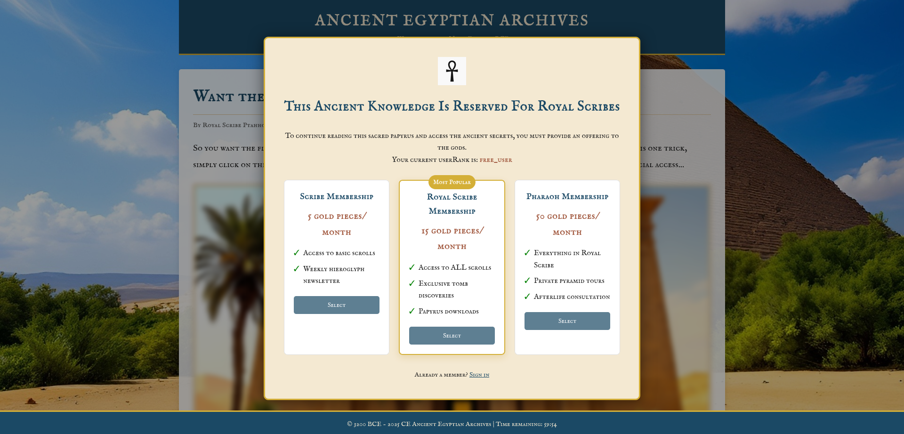
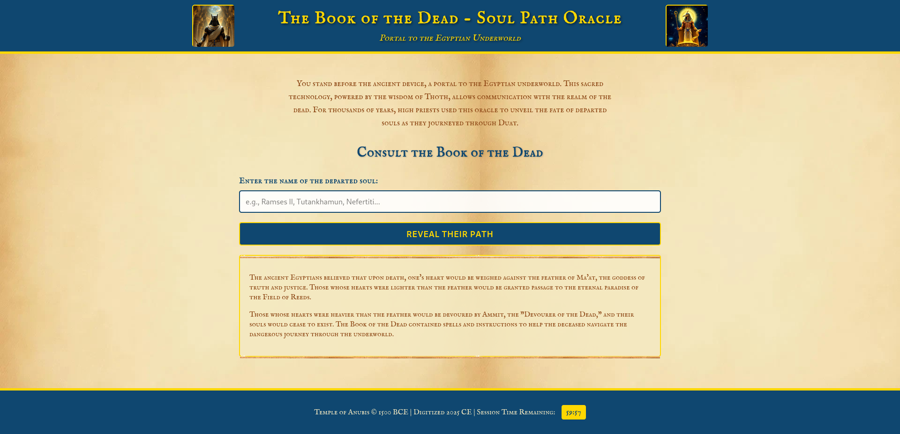
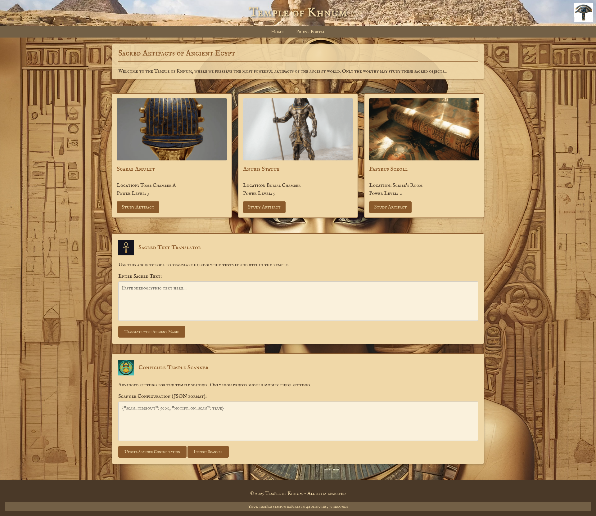
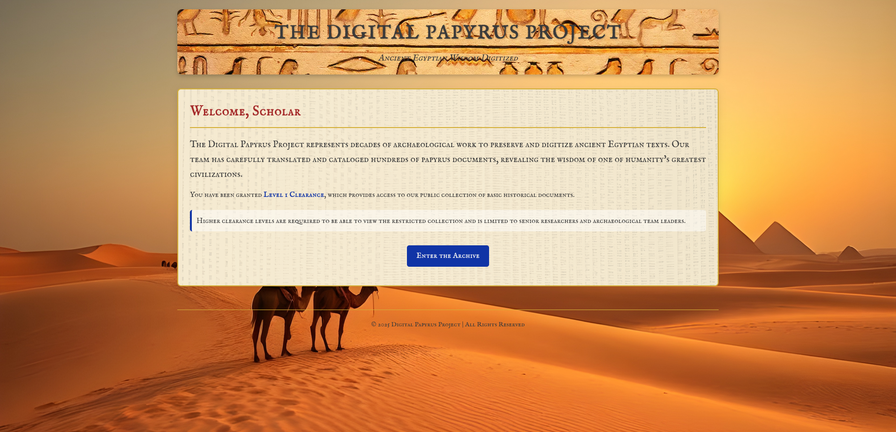
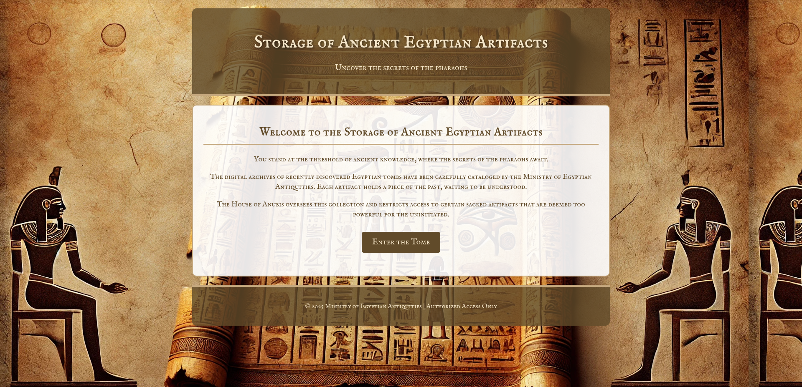
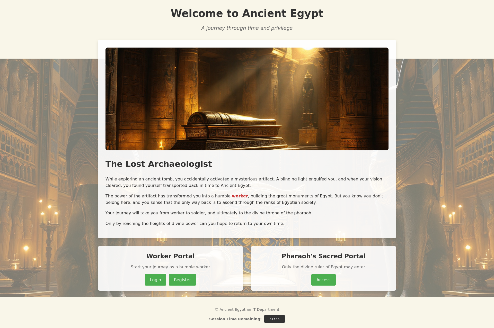

# 🏺 Ancient Egyptian CTF Labs – Beginner-Friendly Vulnerability Challenges






## Overview

Welcome to the **Ancient Egyptian CTF Labs**, a collection of eight beginner-friendly Capture The Flag (CTF) challenges, each themed around ancient Egyptian mythology. These labs were developed as part of a student-led thesis project to provide educational insights into common web vulnerabilities.

Each lab focuses on a specific vulnerability:

- **Authentication**
- **Command Injection**
- **Insecure Direct Object Reference (IDOR)**
- **IDOR 2**
- **Path Traversal**
- **Prototype Pollution**
- **SQL Injection**
- **Server-Side Request Forgery (SSRF)**

## 🛠️ Installation

To set up and run the labs:

1. **Clone the repository:**

   ```bash
   git clone https://github.com/Adam-Tew/Ancient-Egyptian-CTF-Labs-Beginner-Friendly.git
   ```

2. **Navigate to the main directory and build the containers:**

   ```bash
   cd Ancient-Egyptian-CTF-Labs-Beginner-Friendly
   docker-compose up -d --build
   ```

   This will start all labs simultaneously.

3. **To run a specific lab:**

   ```bash
   cd [lab-folder-name]
   docker-compose up -d --build
   ```

   Replace `[lab-folder-name]` with the desired lab's folder name (e.g., `idor1`, `sql`).

## 🧪 Lab Details

Each lab is housed in its own directory, named after the vulnerability it demonstrates. The labs are designed to be self-contained and require minimal setup.

- **Authentication** – `http://127.0.0.1:5017`
- **Command Injection** – `http://127.0.0.1:5016`
- **IDOR 1** – `http://127.0.0.1:5013`
- **IDOR 2** – `http://127.0.0.1:5010`
- **Path Traversal** – `http://127.0.0.1:5012`
- **Prototype Pollution** – `http://127.0.0.1:5011`
- **SQL Injection** – `http://127.0.0.1:5014`
- **SSRF** – `http://127.0.0.1:5015`

> ⚠️ *Note: Your browser might display a security warning; proceed by accepting the risk.*

## 🧰 Tools Required

- **Docker** and **Docker Compose** for running the labs.
- **Web Browser** for interacting with the applications.
- **Burp Suite** (optional) for intercepting and modifying HTTP requests. While some labs can be completed without it, Burp Suite (or equivalent) will be needed to solve other labs.

## 🎓 Educational Purpose

These labs were created for educational purposes, aiming to provide hands-on experience with common web vulnerabilities. They are inspired by real-world scenarios and resources like the Burp Suite Web Security Academy.

## 🤖 Development Notes

The labs were developed by a student with a keen interest in cybersecurity. While some complex components were assisted by AI tools, the primary goal was to learn and understand the intricacies of web vulnerabilities. All images used are AI-generated.

*Disclaimer: These labs are for educational use only. If you intend to use them for commercial purposes, please ensure compliance with relevant licenses and regulations.*

## 📁 Solutions

A `egyptian_ctf_solutions.md` file is included in the repository, providing step-by-step solutions for each lab. This is intended to aid learning.

---

## 🖼️ Additional Lab Images





